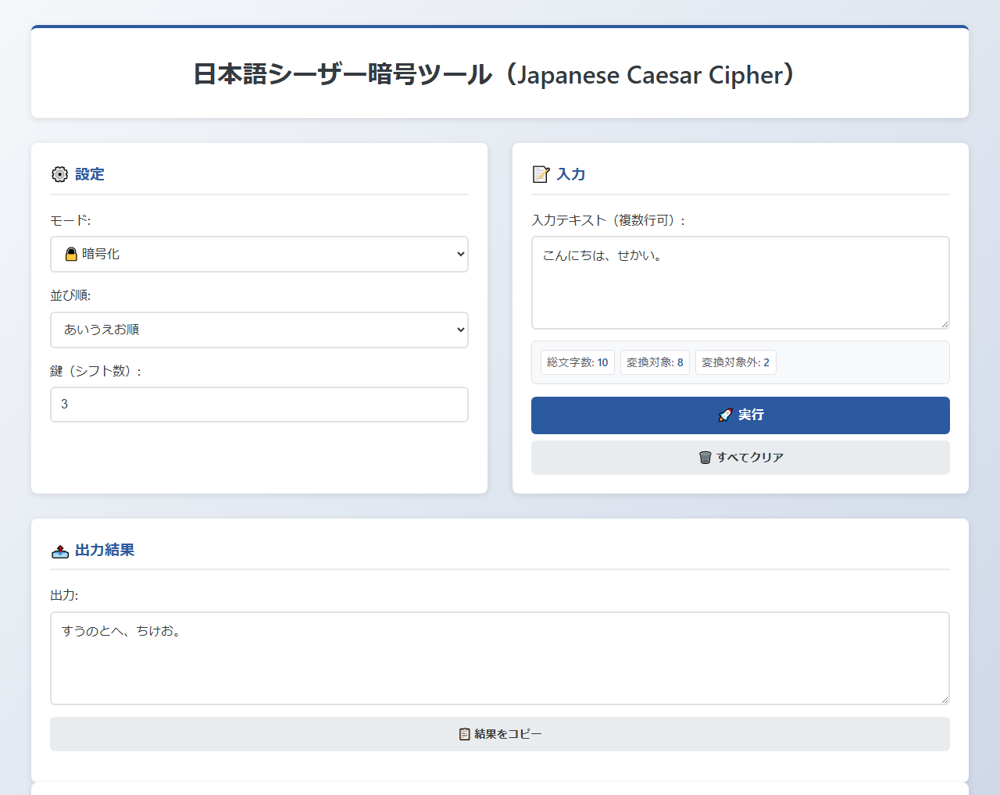
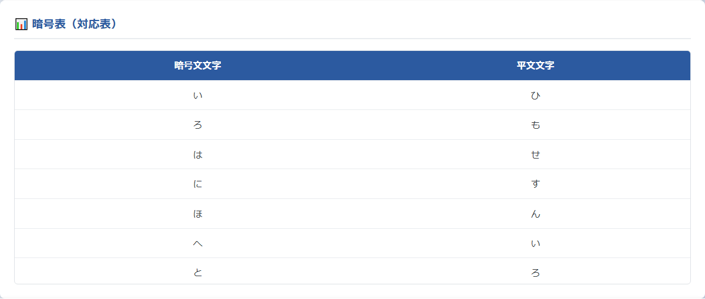
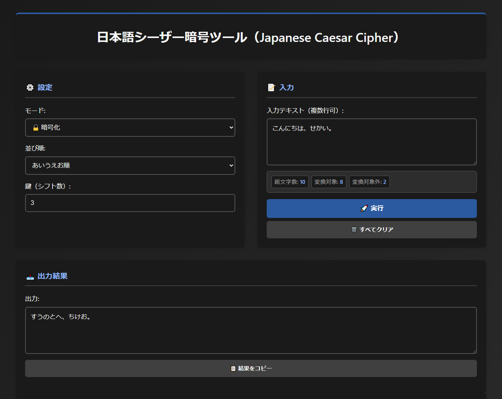

<!--
---
id: day004
slug: japanese-caesar-cipher

title: "Japanese Caesar Cipher"

subtitle_ja: "ひらがな専用シーザー暗号ツール"
subtitle_en: "Caesar Cipher Tool for Japanese Hiragana"

description_ja: "日本語のひらがな文字を対象としたシーザー暗号の暗号化・復号ツール。あいうえお順、いろは順、任意の文字順序に対応。"
description_en: "A web-based Caesar cipher encryption/decryption tool for Japanese hiragana characters. Supports aiueo order, iroha order, and custom character sequences."

category_ja:
  - 古典暗号
  - 換字式暗号
category_en:
  - Classical Cryptography
  - Substitution Cipher

difficulty: 1

tags:
  - caesar-cipher
  - shift-cipher
  - hiragana
  - cryptography
  - japanese
  - classical-cipher
  - web-tool
  - education

repo_url: "https://github.com/ipusiron/japanese-caesar-cipher"
demo_url: "https://ipusiron.github.io/japanese-caesar-cipher/"

hub: true
---
-->

# Japanese Caesar Cipher - ひらがな専用シーザー暗号ツール


[](https://ipusiron.github.io/japanese-caesar-cipher/)

**Day004 - 生成AIで作るセキュリティツール100**

日本語のひらがなを対象としたシーザー暗号の暗号化・復号ツールです。
あいうえお順・いろは順・任意の文字順序を選び、文字の対応関係を表で確認できます。

---

## 🌐 デモページ

👉 [https://ipusiron.github.io/japanese-caesar-cipher/](https://ipusiron.github.io/japanese-caesar-cipher/)

ブラウザーで直接お試しいただけます。

---

## 📸 スクリーンショット

> 
>
> *「こんにちは、せかい。」を「すうのとへ、ちけお。」へ変換。総文字数10・変換対象8・変換対象外2*

> 
>
> *復号時の「暗号文文字｜平文文字」の対応表。先頭は「い→ひ」「ろ→も」「は→せ」*

> 
>
> *OSのダーク設定に追従し、暗い入力欄と白文字の実行ボタンを表示した同じ暗号化状態*

---

## ✨ 機能

- **3つの並び順**：あいうえお順46文字、いろは順48文字、任意の文字順序
- **暗号化・復号**：指定した鍵で文字をずらす変換
- **対応表**：入力文字と出力文字の対応を表示し、復号モードでは見出しを入れ替え
- **文字数の統計**：総文字数・変換対象・変換対象外の件数
- **結果のコピー**：出力をクリップボードへコピー
- **ダークモード**：OSの設定に追従
- **複数行入力**：改行を含む文章に対応
- **変換対象外の保持**：既定の並び順では、ひらがな以外の記号・漢字・カタカナなどをそのまま出力
- **ブラウザー内で完結**：インストール不要

---

## 📖 使い方

1. モードを「暗号化」または「復号」から選択する。
2. 並び順を「あいうえお順」「いろは順」「任意」から選択する。
3. 「任意」の場合、変換対象の文字を重複なく並べて入力する。
4. 鍵を0〜文字数−1の整数で入力する。
5. 入力欄に文章を入力し、「実行」を押す。入力欄・鍵・文字順序の欄ではCtrl+Enter（Macは⌘+Enter）も使用できる。
6. 出力を確認して「結果をコピー」を押す。コピーできない場合は、選択された出力を手動でコピーする。

### 使い方の例

| 入力 | 並び順 | 鍵 | モード | 結果 |
| --- | --- | ---: | --- | --- |
| `こんにちは` | あいうえお順 | 3 | 暗号化 | `すうのとへ` |
| `すうのとへ` | あいうえお順 | 3 | 復号 | `こんにちは` |
| `わをん` | あいうえお順 | 3 | 暗号化 | `あいう` |
| `いろはにほへと` | いろは順 | 1 | 暗号化 | `ろはにほへとち` |
| `がっこうへ いく。` | あいうえお順 | 3 | 暗号化 | `がっすかみ おさ。` |
| `あかさ` | 任意: `あかさたなはまやらわ` | 1 | 暗号化 | `かさた` |

---

## 🔬 仕組み

並び順の中の位置を0から数え、平文の位置をp、暗号文の位置をc、鍵をk、文字数をnとします。
暗号化は`c = (p + k) mod n`、復号は`p = (c − k) mod n`で求めます。

### 文字セット

| 並び順 | 文字数 | 文字 |
| --- | ---: | --- |
| あいうえお順 | 46 | `あいうえおかきくけこさしすせそたちつてとなにぬねのはひふへほまみむめもやゆよらりるれろわをん` |
| いろは順 | 48 | `いろはにほへとちりぬるをわかよたれそつねならむうゐのおくやまけふこえてあさきゆめみしゑひもせすん` |

いろは順は、いろは歌47文字（「ゐ」「ゑ」を含みます）の末尾に「ん」を足した48文字です。
この順序が適さない場合は「任意」を使えます。
あいうえお順には「ゐ」「ゑ」がないため、入力してもそのまま出力されます。

画面で指定できる鍵の範囲は0〜n−1で、鍵0は無変換です。
無変換を除いた鍵の候補は45個（いろは順は47個）しかなく、総当たりですぐに解けます。
暗号ロジックは負の鍵や文字数以上の鍵も同じ範囲へ正規化して処理します。

入力とカスタム順序は、処理時にUnicodeのNFCで正規化します。
たとえば「か」と結合濁点は「が」として扱いますが、入力欄の文字列は書き換えません。
統計は正規化後のコードポイント単位で数え、改行や絵文字も1文字として扱います。

---

## ⚠️ 注意点

- 既定の並び順の変換対象はひらがなのみである。それ以外の文字はそのまま残る。
- 濁点・半濁点・小書き・長音も変換対象にしたい場合は、並び順の「任意」を使う。
- 変換対象外の文字（漢字・カタカナ・句読点・空白）がそのまま残るため、文節や語の区切りから内容を類推できる可能性がある。
- 古典暗号としての理解・学習用途に限る。重要な機密情報を保護する実用的な暗号ではない。

---

## 🔗 関連ツール

- [Day003 Caesar Cipher Wheel](https://github.com/ipusiron/caesar-cipher-wheel)：英字のシーザー暗号を円盤で学ぶツール
- [Day008 Caesar Cipher Breaker](https://github.com/ipusiron/caesar-cipher-breaker)：シーザー暗号の解読ツール
- [Day014 忍びいろはの暗号ツール](https://github.com/ipusiron/shinobi_iroha_cipher)：いろはを使う日本の古典暗号

---

## 🧪 テスト

Node.js 22以上で、次のコマンドを実行します。依存パッケージはありません。

```sh
npm test
```

Node.js標準の`node --test`を使います。GitHub Actionsでもpushとpull requestごとに自動実行します。
既知解答、往復変換、鍵の正規化、カスタム順序、HTMLの静的条件に加え、
READMEの使い方の例・文字セット・画像参照・YAML構造、配色のコントラスト、ソースの整形を検証します。

---

## 🔒 セキュリティ・プライバシー

アプリは外部への通信を追加せず、入力内容を保存しません。localStorage・Cookieも使いません。
入力値は`textContent`と`value`にだけ設定するため、HTMLエスケープは不要です。
エスケープや文字列の除去、前後の空白を削った値の書き戻しは行いません。
「すべてクリア」を押した場合のみ、入力・出力・カスタム順序の欄を空にします。

HTMLにContent Security Policyと`no-referrer`を設定しています。

---

## 📁 ディレクトリー構造

```text
japanese-caesar-cipher/
├── .github/
│   └── workflows/
│       └── test.yml       # Node.js 22のCI
├── assets/
│   ├── screenshot.png    # ライトテーマの暗号化画面
│   ├── screenshot2.png   # 復号モードの対応表
│   └── screenshot3.png   # ダークテーマの暗号化画面
├── test/
│   ├── cipher.test.js    # 暗号ロジックの既知解答・往復・回帰
│   ├── readme.test.js    # READMEの例・文字セット・画像・YAML
│   ├── html.test.js      # HTMLとDOM処理の静的条件
│   ├── contrast.test.js  # ライト・ダークの配色
│   └── format.test.js    # 最長行と行数
├── cipher.js             # DOMに依存しない暗号ロジック
├── index.html            # 画面の構造
├── script.js             # 画面の描画とイベント処理
├── style.css             # 表示と配色
├── package.json          # 依存なしのテストコマンド
├── CLAUDE.md             # 開発ガイド
├── README.md             # 本ドキュメント
├── LICENSE               # MITライセンス
├── .gitignore            # Gitの除外指定
└── .nojekyll             # GitHub PagesのJekyll処理を無効化
```

## 💻 動作環境

モダンブラウザーで動作します。`index.html`を`file://`で直接開いても利用できます。
コピーはブラウザーの権限や環境によって失敗する場合があり、その際は出力欄を選択して手動でコピーします。
テストにはNode.js 22以上が必要です。

---

## 📄 ライセンス

このプロジェクトは[MITライセンス](./LICENSE)の下で公開されています。

---

## 🛠️ このツールについて

本ツールは、「生成AIで作るセキュリティツール100」プロジェクトの一環として開発されました。このプロジェクトでは、AIの支援を活用しながら、セキュリティに関連するさまざまなツールを100日間にわたり制作・公開していく取り組みを行っています。

プロジェクトの詳細や他のツールについては、以下のページをご覧ください。

🔗 [https://akademeia.info/?page_id=42163](https://akademeia.info/?page_id=42163)
